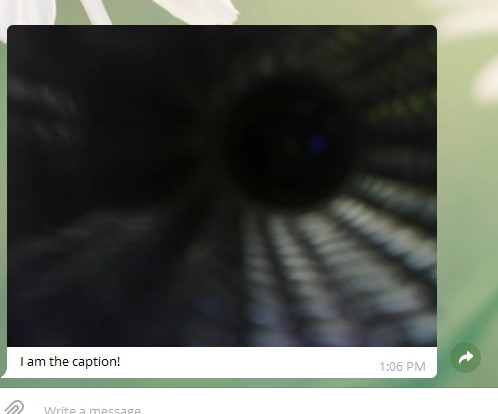

# ESP32-Cam-Telegram
Demo of sending a photo from a ESP32-CAM acting as a Telegram BOT

1. Shows bugfix with missing println - mod to library and ESP-Cam2.ino
2. Shows example of sending large and small jpegs - same mod to library and ESP32-Cam3.ino
3. Shows code and example to send a caption with a picture - more mods to library in /caption folder and ESP32-Cam4.ino

https://github.com/witnessmenow/Universal-Arduino-Telegram-Bot/issues/186#issue-654370487

Bugfix on line 239 of .cpp 

Also demo sending a big .jpg two ways - one of which fails

Some other debugging changes - search for jz

Just add wifi name/pass and BOTtoken, then send /photo from your Telegram BOT and look at serial monitor for debug messages, and telegram for one picture

-------------------

ESP32-Cam3.ino takes the commands /qvga (320x240, about 4 kb) and /uxga (1600x1200, about 100kb) to send different sized photos 
- the qvga works on both send techqinues
- the uxga fails on second send technqiue

------------------

August 7, 2020
ESP32-Cam4.ino along with the Telegram-Bot library with the caption folder
- send /caption to have your telegram bot send a photo with caption
- you must use the exmaple and library from the /caption folder

